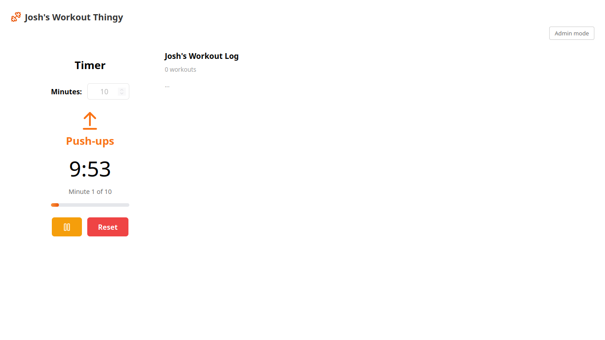
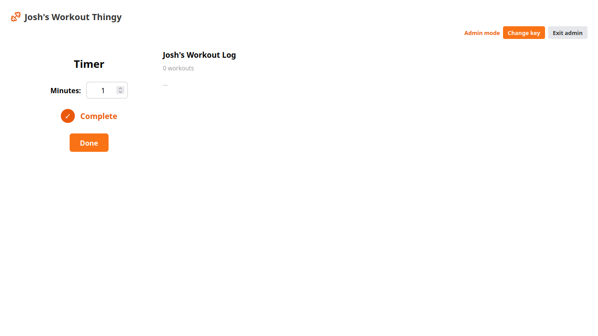
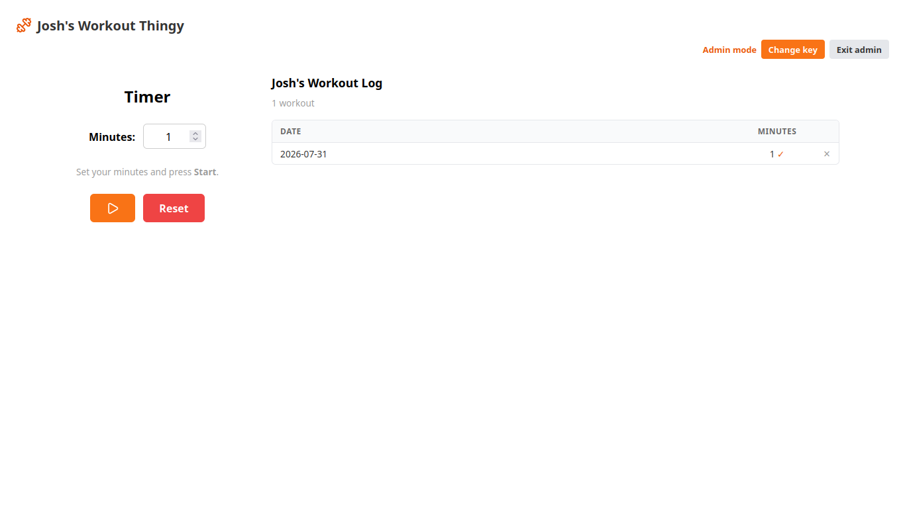

# Josh's Workout Thingy

A simple, self-hosted workout timer that alternates between **push-ups** and **pull-ups** every minute, keeps a running log of completed workouts, and saves everything to the cloud so it works from any device.

Built with [SvelteKit](https://kit.svelte.dev) + [Svelte 5](https://svelte.dev), deployed on [Vercel](https://vercel.com), with workout history persisted to [Upstash Redis](https://upstash.com).

## Features

- **Interval timer** — set a number of minutes and start. Each minute alternates between push-ups and pull-ups, with a countdown display, progress bar, and a beep at every minute boundary.
- **Workout history** — every completed workout is logged with its date and duration. The log is stored in Upstash Redis, so it persists across page reloads, browsers, and redeploys.
- **Admin mode** — unlock admin features with a key to mark a workout as completed and to delete individual (or all) history entries.

## Screenshots

### Home screen

The first screen a user sees, with the timer running.



### Completed workout

The completion state shown after a workout finishes (not in admin mode).



### Admin mode and workout log

Admin mode active, with a workout showing in the history log.



## Getting started

```bash
npm install
npm run dev
```

Open http://localhost:5173.

### Environment variables

The workout log is stored in Upstash Redis. Create a free database at [upstash.com](https://upstash.com) and add these to your environment (for local dev, a `.env` file; for deployments, your hosting provider's env var settings):

```
UPSTASH_REDIS_REST_URL=https://<your-database>.upstash.io
UPSTASH_REDIS_REST_TOKEN=<your-token>
```

If the env vars are missing, the app falls back to in-memory storage (workouts won't persist across reloads).

### Admin key

Admin mode is protected by a key, verified against a SHA-256 hash in `src/lib/server/auth.ts`. Enter the key via the **Admin mode** button in the top-right corner; the app stores it in `localStorage` on your device.

## Scripts

| Command          | Description                         |
| ---------------- | ----------------------------------- |
| `npm run dev`    | Start the dev server                |
| `npm run build`  | Production build (Vercel adapter)   |
| `npm run check`  | Type-check with svelte-check        |
| `npm run preview`| Preview the production build locally|

## Tech stack

- **SvelteKit** with the Vercel adapter (Node.js runtime)
- **Svelte 5** runes (`$state`, `$derived`, `$props`, `$effect`)
- **Upstash Redis** (`@upstash/redis`) for durable workout storage
